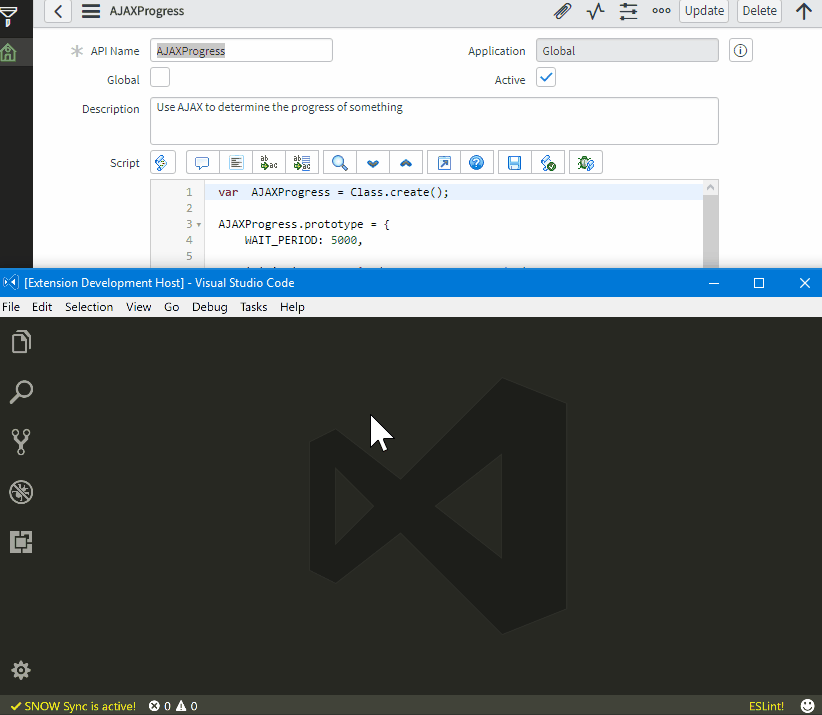
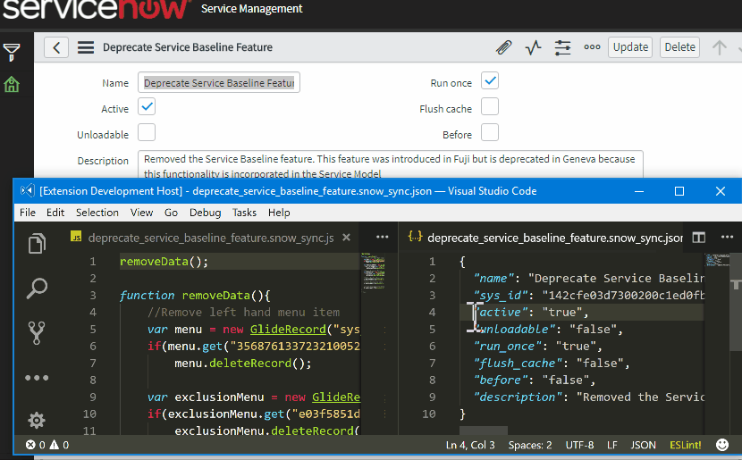

# snow-sync readme

This is a simple extensions for vscode. Major functionality (get/put scripts) is implemented. Currently it may be considered as a beta release. 

Basic usage demo:


Configuration update demo:


## Version

Current version: 0.2.0 (early beta).

## Installation

This extension is not yet published in marketplace. In order to use it, simply:
1. Copy/download this repository and save it to `HOME DIRECTORY/.vscode/extensions`
2. Restart `Visual Studio Code`

## Usage

1. Run `SNOW Sync: Start work` command
2. Check settings under `SNOW Sync: Show settings` command
3. Choose your script:
* Either with `SNOW Sync: Get script` command
   
   Optional: In case of business rules or client scripts, insert table name to load scripts that work on particular table.

   The script will be saved to your hard disk, under `project root dir given in settings/instance name given in settings/chosen script type` with `.snow_sync.js` extension.

* Or open previously saved script

   A config file (called `name of the script.snow_sync.json`) must exist in the same directory as script and must contain at least `sys_id` in `JSON` format, i.e.

   ```
   {
       "sys_id": 12312312312312312312312312312312
   }
   ```

4. Modify your script
5. Save it

   It will be automatically uploaded to your instance.

## Features

This extensions allows you to download chosen script (currently supports business rules, client scripts, script includes, fix scripts, validation scripts, email notification scripts and ui scripts) and display it in `Visual Studio Code` IDE. You can modify it and once saved, it will be uploaded to you instance directly.

## Requirements

1. Active ServiceNow instance accepting GET/PUT requests
2. Username/password for that instance with permissions to read scripts

## Known Issues

- It fails to load scripts when given instance has domain name
- Sometimes script fails to load
- No multiple instances
- It doesn't check for permissions

## Release Notes

See [CHANGELOG.md](CHANGELOG.md).