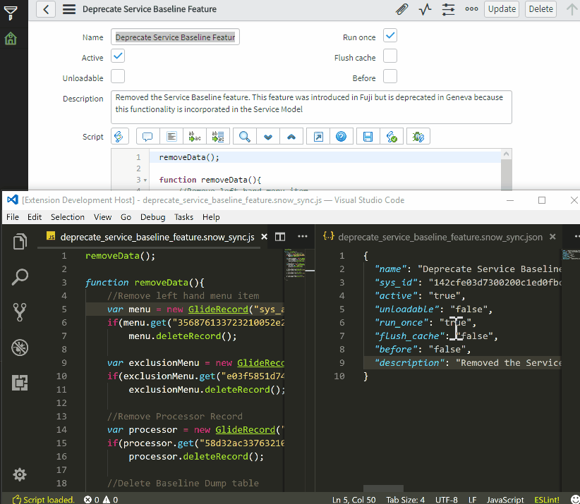

# snow-sync readme

This is a simple extensions for vscode. Major functionality (get/put scripts) is implemented. Currently it may be considered as a beta release. 

Basic usage demo:


Configuration update demo:


## Version

Current version: 0.4.0 (early beta).

## Installation

This extension is not yet published in marketplace. In order to use it, simply:
1. Copy/download this repository and save it to `HOME DIRECTORY/.vscode/extensions`
2. Restart `Visual Studio Code`

You can also download a `vsix` file from this repository and [install it directly in your IDE](https://code.visualstudio.com/docs/editor/extension-gallery#_install-from-a-vsix).

## Usage

1. Run `SNOW Sync: Start work` command
2. Check settings under `SNOW Sync: Show settings` command
3. Choose your script:
* Either with `SNOW Sync: Get script` command
   
   Optional: In case of business rules or client scripts, insert table name to load scripts that work on particular table.

   The script will be saved to your hard disk, under `project root dir given in settings/instance name given in settings/chosen script type` with `.snow_sync.js` extension. Along with the script, its configuration file with `script name.snow_sync.json` name will be saved and opened in second editor, next to the current one.

* Or open previously saved script

   A config file (called `name of the script.snow_sync.json`) must exist in the same directory as script and must contain at least `sys_id` in `JSON` format, i.e.

   ```
   {
       "sys_id": "12312312312312312312312312312312"
   }
   ```

4. Modify your file
5. Save it

   It will be automatically uploaded to your instance.

## Features

This extensions allows you to download chosen script (currently supports business rules, client scripts, script includes, fix scripts, email notification scripts and ui scripts) and its configuration and display it in `Visual Studio Code` IDE. You can modify it and once saved, it will be uploaded to you instance directly. You can also modify some configuration options - they will also be uploaded on save.

You can also view your currently chosen instance's statistics (`stats.do`) - they will be displayed as a `HTML` preview in new editor.

### Configuration options 
This extension comes with additional configuration options for every script that can be chosen. You can select which fields will be downloaded and saved to script config file. How to change them?

1. Open settings panel (`Ctrl + comma`)
2. Search for `snow` - all settings are prefixed with `snow_sync`
3. Click on pencil that appears on the left side of the editor when you hover over chosen setting - it will be copied to your personal setting file (_User settings_)
4. Change the value - it should be a string with comma-separated column names from selected table, i.e. when you change the `snow_sync.fix_script_fields` setting, include only columns from Fix Script table

## Requirements

1. Active ServiceNow instance accepting GET/PUT requests
2. Username/password for that instance with permissions to read scripts

## Known Issues

- It fails to load scripts when given instance has domain name
- No multiple instances
- It doesn't check for permissions

## Release Notes

See [CHANGELOG.md](CHANGELOG.md).